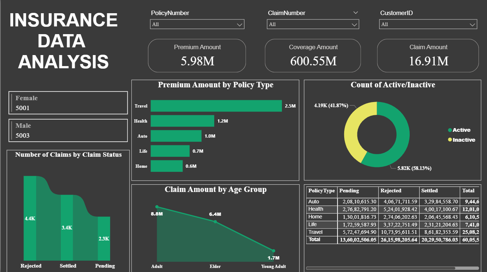
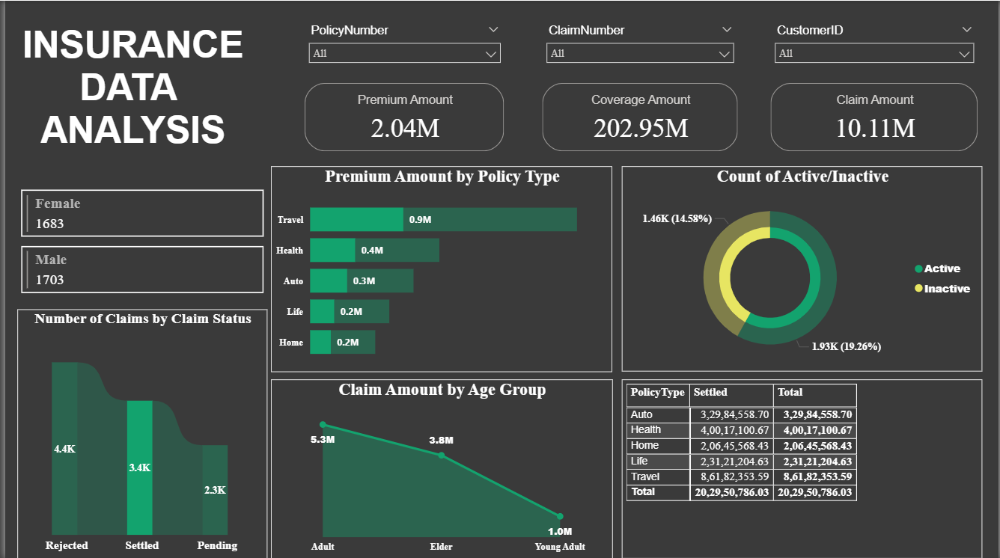
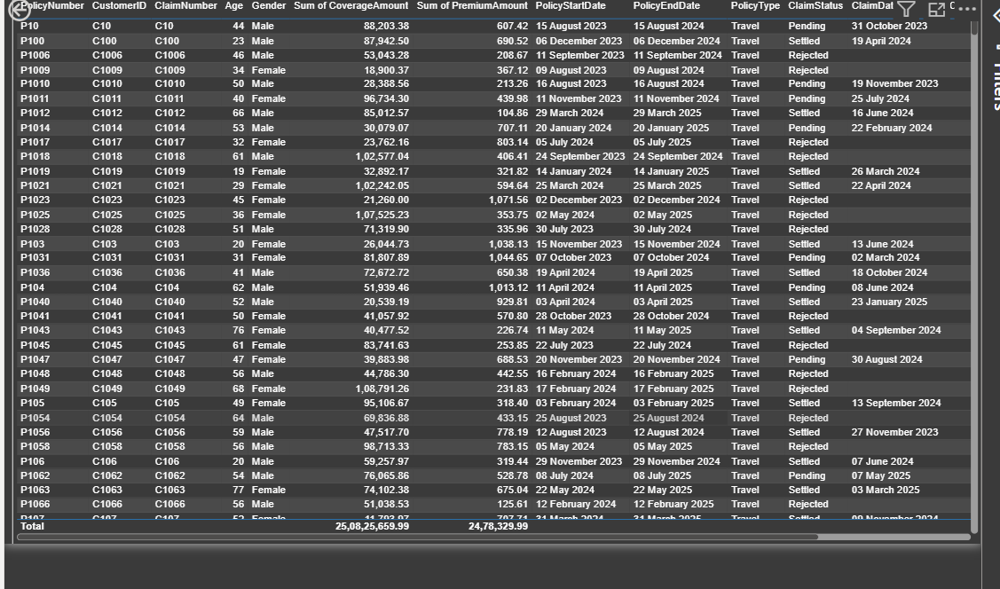

# 📊 Insurance Policy & Claims Analysis Dashboard (Power BI)

## 📌 Project Overview
This project presents an interactive Power BI dashboard designed to analyze insurance policy performance and claim distribution.

The dashboard provides executive-level KPIs, policy-type segmentation, claim status analysis, and drill-through capability for detailed transactional insights.

---

## 📁 Repository Contents

- `insurance_dashboard.pbix` – Power BI dashboard file  
- `InsuranceData.csv` – Dataset used for analysis  
- `screenshots/` – Dashboard preview images  

---

## 📈 Key Metrics Displayed

- Total Premium Amount
- Total Coverage Amount
- Total Claim Amount
- Active vs Inactive Policy Count
- Gender-wise Policy Distribution

---

## 🔍 Business Insights Provided

- Premium distribution across policy types
- Claim status breakdown (Pending, Rejected, Settled)
- Claim amount analysis by age group
- Policy performance comparison
- Identification of claim-heavy segments
- Detailed record-level inspection via drill-through

---

## 📊 Dashboard Features

### 1️⃣ Policy Performance Overview
- Premium Amount by Policy Type
- Coverage Exposure Summary
- Active vs Inactive Policy Breakdown
- Gender Distribution of Policyholders

### 2️⃣ Claims Analysis
- Number of Claims by Claim Status
- Claim Amount by Age Group
- Policy-Type Claim Summary Table

### 3️⃣ Drill-Through Functionality
- Drill-through by Policy Type
- Detailed view including:
  - Policy Number
  - Customer ID
  - Claim Number
  - Coverage & Premium Amount
  - Claim Status
  - Policy Start & End Dates

### 4️⃣ Interactive Filtering
- Policy Number slicer
- Claim Number slicer
- Customer ID slicer

---

## 📊 Dashboard Preview

### Overview

### Settled Claimed Status Analysis

### Table Visuals

---

## 🛠 Tools & Techniques Used

- Power BI
- Data Modeling
- DAX Measures
- KPI Design
- Drill-Through Navigation
- Interactive Report Design

---

## 🎯 Project Outcome

This dashboard demonstrates the ability to transform insurance policy and claims data into structured business insights using interactive reporting and segmentation analysis.
